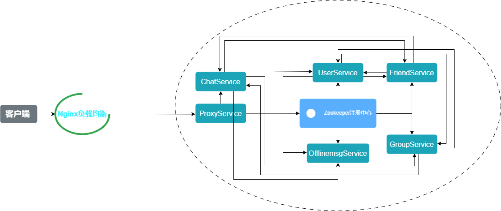

# distroChat

## 内容列表

- [背景](#背景)
- [前置模块讲解](#前置模块讲解)
- [distroChat架构设计](#架构设计)
- [系统的不足之处](#系统的不足之处)
- [项目中遇到的问题](#项目中遇到的问题)
- [数据库表结构](#数据库表结构)
- [安装说明](#安装说明)

## 背景
本项目是一个基于分布式集群架构的聊天服务器。通过独立开发的网络库ReactorX和RPC框架mprpc，实现了登录与注册节点、用户与好友节点、群组节点以及离线消息节点，支持一对一聊天和群聊业务。该项目使用VSCode作为开发工具，采用CMake构建项目，并配备了Shell编译脚本。整个代码结构在架构层、网络层、业务层和数据模块进行了解耦，以提高系统的松耦合性、可维护性和可扩展性。 

**工作内容：**

+ 独立实现了一个网络库reactorX，基于Reactor网络模型和线程池实现，作为聊天系统的网络模块；
+ 基于protobuf独立实现一个RPC框架mprpc，用于分布式通信，提高系统的松耦合性、可扩展性和容错性；
+ 实现了数据库连接池ConnectionPool用来提高MySQL数据库的访问瓶颈;
+ 聊天系统使用ProxyService作为服务单元的入口，同时利用Niginx的负载均衡功能来降低ProxyService的压力。根据客户端发送的请求信息判断业务类型，通过Zookeeper定位提供该服务的分布式节点，并将请求信息分配给对应节点处理；
+ 基于Redis的发布-订阅功能，实现跨服务器的消息转发。

## 前置模块讲解
网络库：[reactorX](https://github.com/jixu1340036583/reactorX)

线程池：[ThreadPool](https://github.com/jixu1340036583/ThreadPool)

连接池：[ConnectionPool](https://github.com/jixu1340036583/ConnectionPool)

rpc框架：[mprpc](https://github.com/jixu1340036583/mprpc)

## 架构设计
distroChat由代理节点ProxyService、登录与注册节点UserService、好友节点FriendService、群组节点GroupService和离线消息节点OfflinemsgService。各个节点之间独立而又有联系。

### 如何解耦网络I\O模块-业务模块-数据模块？
ChatServer:服务器类，构造函设置消息回调ChatServer::onMessage和连接回调ChatServer::onConnection。
+ 在消息回调中，根据消息类型从ChatService::getHandler()中获取对应的回调函数。
然后执行回调。
+ 到这里，我们已经实现了聊天服务器ChatServer类，并且这个类已经完全闭合，因为该类只依赖于ChatService类。
在ChatService类中，有一个unordered_map，key为消息类型，value为对处理消息的事件回调方法类型。并且回调方法的增删改都在其构造函数内进行。因此在ChatServer类中，只需要根据对应的消息类型获取对应的回调函数即可，耦合度非常低，基本不需要改动。

至此，已经实现了服务器的架构层-网络I/O模块 - 业务模块 - 数据模块三层模型中的第一层解耦。

 **ORM，即Object-Relational Mapping（对象关系映射）**，它的作用是在**关系型数据库**和**业务实体对象**之间作一个映射，这样，我们在具体的操作业务对象的时候，**就不需要再去和复杂的SQL语句打交道，只需简单的操作对象的属性和方法**。
 **ORM优缺点**
+ **优点**

    1.隐藏了数据访问细节，“封闭”的通用数据库交互，ORM的核心。他使得我们的通用数据库交互变得简单易行，并且完全不用考虑该死的SQL语句。快速开发，由此而来。

    2.ORM使我们构造固化数据结构变得简单易行。在ORM年表的史前时代，我们需要将我们的对象模型转化为一条一条的SQL语句，通过直连或是DB helper在关系数据库构造我们的数据库体系。而现在，基本上所有的ORM框架都提供了通过对象模型构造关系数据库结构的功能。这，相当不错。
+ **缺点**
    
    1.无可避免的，自动化意味着映射和关联管理，代价是牺牲性能（早期，这是所有不喜欢ORM人的共同点）。现在的各种ORM框架都在尝试使用各种方法来减轻这块（LazyLoad，Cache），效果还是很显著的。

    2.面向对象的查询语言(X-QL)作为一种数据库与对象之间的过渡,虽然隐藏了数据层面的业务抽象,但并不能完全的屏蔽掉数据库层的设计,并且无疑将增加学习成本。

    3.对于复杂查询，ORM仍然力不从心。虽然可以实现，但是不值的。视图可以解决大部分calculated column，case ，group，having,order by, exists，但是查询条件(a and b and not c and (d or d))。
    世上没有驴是不吃草的(又想好又想巧,买个老驴不吃草)，任何优势的背后都隐藏着缺点，这是不可避免的。问题在于，我们是否能容忍缺点。
**代码实现**

**在usermodel.h中：**
+ 首先，先定义一个User类，作为匹配User表的数据类，类中每个数据成员对应User表中的一个字段；
+ 其次，定义一个数据模型UserModel，依赖于Connection（数据库连接）和User类；
+ 其中定义了insert、update、delete等方法，在方法内定义sql语句。
+ UserModel类就作为数据模块，上层业务模块只管根据客户端发来的数据构造一个User对象，然后只管调用下层UserModel提供的方法，而不关心其具体实现。
至此，服务器的网络I/O模块 - 业务模块 - 数据模块三层模型已经基本实现。互相分离并且耦合度低。								

对于架构层来说，我采用的自己实现的mrpc分布式框架，简单来说，我将远程调用的细节全部隐藏在框架中，只将接口暴露给应用层。

## 系统的不足之处

## 项目中遇到的问题
在用redis发布订阅模式解决跨服务器通信时，我单开了一个线程来循环接收处理订阅频道的消息。

但是redis的subscribe在订阅了频道之后是会阻塞住的，这就导致当服务器接收到了用户的登录请求后，然后订阅频道时直接被阻塞，然后导致I/O模块就被阻塞在了OnMessage回调，进而整个工作线程就被阻塞了，后续其他的登录请求也无法响应。

后来我经过调试，看redis源码，才发现从hiredis的redisCommand源码上可以看出，它实际上相当于调用了这三个函数：

redisAppendCommand 把命令写入本地发送缓冲区
redisBufferWrite 把本地缓冲区的命令通过网络发送出去
redisGetReply 阻塞等待redis server响应消息

所以我在实现订阅的函数中只做了发送命令的实现，将循环阻塞等待消息的功能放到单开的线程中。这样就避免了subscribe的问题。

## 安装说明

开发环境：Ubuntu VsCode

编译器：g++

编译工具：CMake

编程语言：C++

protobuf: protobuf-cpp-3.21.9

Zookeeper: zookeeper-3.4.10

mysql客户端API安装:sudo apt-get install libmysqlclient-dev

nginx:1.23.3
